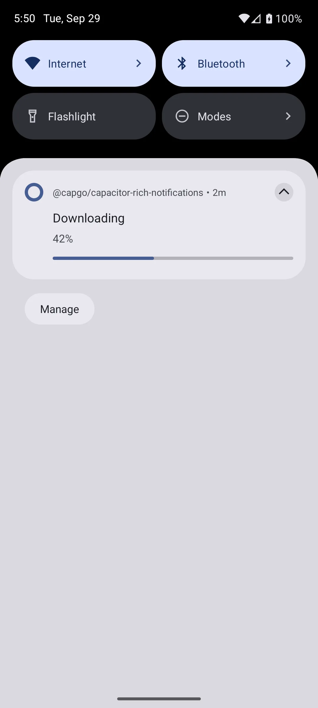

# @capgo/capacitor-rich-notifications

<a href="https://capgo.app/?ref=plugin_rich_notifications"></a>

<div align="center">
  <p><b>Capgo</b>: push fixes to your Capacitor users in minutes, build signed iOS and Android apps without a Mac, and roll back in one click.</p>
  <h2><a href="https://capgo.app/register/?ref=plugin_rich_notifications">➡️ Get started for free</a></h2>
  <p>14-day unlimited free trial. No credit card required</p>
  <p><a href="https://capgo.app/consulting/?ref=plugin_rich_notifications">Missing a feature? We'll build the plugin for you 💪</a></p>
</div>

<p align="center">
  
</p>

Show polished **local** notifications from your Capacitor app: Android channels and groups, progress and ongoing alerts, big-text/picture/inbox layouts, action buttons with inline reply, exact scheduling, full-screen intents, and optional foreground-service promotion. It does not register for remote push (use [@capgo/capacitor-notifications](https://github.com/Cap-go/capacitor-notifications) for FCM/APNs). Compared with the stock local notification APIs, you get one TypeScript surface for rich layouts, scheduling, tap/dismiss events, launch detection, and badges on iOS and Android (with a browser Notification fallback on web).

## Features

- **Permissions** - `checkPermission` / `requestPermission` for notification access (including Android 13+ `POST_NOTIFICATIONS`).
- **Android channels** - Create channel groups, channels with importance/vibration/sound, and delete channels.
- **Rich layouts** - Big text, picture, and inbox styles; large images from HTTPS or data URLs.
- **Progress and ongoing** - Download-style progress bars and notifications that stay until you cancel them.
- **Actions** - Register reusable categories or attach per-notification buttons, including inline text reply.
- **Scheduling** - Fire once at a Unix timestamp or on a repeating interval (exact alarms on Android when permitted).
- **Full-screen and FGS** - Optional full-screen intent for calls/alarms and foreground-service notifications (Android, opt-in permissions).
- **Lifecycle events** - `press` and `dismiss` listeners, plus `getInitialNotification` when the app opens from a tap.
- **Badge** - Set the app icon badge count on iOS.
- **iOS polish** - `UNUserNotificationCenter` categories, interruption levels (`passive` through `timeSensitive`), and scheduled triggers.

## Use cases

- File upload/download progress in the notification shade.
- Chat-style messages with a Reply action and inline text input.
- Reminders and snoozed tasks scheduled for a specific time or interval.
- Incoming call or alarm UI via full-screen intent on Android.
- Long-running tasks that must stay visible with a foreground service notification.
- Deep linking: read which notification (and action) launched the app.

## Compatibility

| Plugin version | Capacitor compatibility | Maintained |
| -------------- | ----------------------- | ---------- |
| v8.\*.\*       | v8.\*.\*                | ✅          |
| v7.\*.\*       | v7.\*.\*                | On demand   |
| v6.\*.\*       | v6.\*.\*                | On demand   |

Policy:

- New plugins start at version `8.0.0` (Capacitor 8 baseline).
- Backward compatibility for older Capacitor majors is supported on demand.

## Install

```bash
npm install @capgo/capacitor-rich-notifications
npx cap sync
```

With Bun:

```bash
bun add @capgo/capacitor-rich-notifications
bunx cap sync
```

## Documentation

- [Plugin docs](https://capgo.app/docs/plugins/rich-notifications/) on capgo.app
- [Tutorial](https://capgo.app/plugins/capacitor-rich-notifications/)
- [Capgo](https://capgo.app/?ref=plugin_rich_notifications) for live updates and plugin support

## iOS setup

No custom `Info.plist` keys are required for standard local notifications. Call `RichNotifications.requestPermission()` before showing notifications. Register action categories with `registerActions` and reference `categoryId` on each notification. Use `interruptionLevel` for time-sensitive delivery on iOS 15+. The `critical` level requires Apple's [Critical Alerts](https://developer.apple.com/documentation/usernotifications/unnotificationinterruptionlevel/critical) entitlement; without it, use `timeSensitive` or `active`.

## Android setup

The plugin library merges `POST_NOTIFICATIONS` into your app (required to post on Android 13+). Request runtime permission with `requestPermission()`. **Minimum SDK:** 24 (see the plugin `android/build.gradle`).

For **exact alarms**, **full-screen intents**, and **foreground service** notifications, add opt-in permissions and the foreground service to your app manifest. From your project root:

```bash
bun run scripts/apply-notification-permissions.mjs --project path/to/your-app
```

That helper adds `SCHEDULE_EXACT_ALARM`, `USE_FULL_SCREEN_INTENT`, `FOREGROUND_SERVICE`, `FOREGROUND_SERVICE_SPECIAL_USE`, and declares `app.capgo.richnotifications.RichForegroundService` with `foregroundServiceType="specialUse"`. Create notification channels before posting (`createChannel`). Use `foregroundService: true` and `fullScreen: true` only when those permissions are present.

On **web**, the plugin uses the browser Notification API; `schedule` uses `setTimeout` and only runs while the page stays open. Channels, groups, `fullScreen`, and `foregroundService` are Android-only (no-ops or errors as documented in the API).

## Usage

Request permission, create a channel on Android, show a notification, and listen for taps:

```typescript
import { RichNotifications } from '@capgo/capacitor-rich-notifications';

await RichNotifications.requestPermission();

await RichNotifications.createChannel({
  id: 'messages',
  name: 'Messages',
  importance: 'high',
});

const { id } = await RichNotifications.display({
  title: 'Hello',
  body: 'Tap to open the app',
  channelId: 'messages',
});

await RichNotifications.addListener('press', (event) => {
  console.log('pressed', event.id, event.actionId, event.input);
});

const launch = await RichNotifications.getInitialNotification();
if (launch.notification) {
  console.log('opened from', launch.notification.id);
}
```

**Progress notification (Android):**

```typescript
await RichNotifications.display({
  title: 'Downloading',
  body: '42%',
  channelId: 'messages',
  ongoing: true,
  progress: { current: 42, max: 100 },
});
```

**Schedule in 5 seconds:**

```typescript
await RichNotifications.schedule({
  notification: {
    title: 'Reminder',
    body: 'Five seconds later',
    channelId: 'messages',
  },
  trigger: { type: 'interval', interval: 5 },
});
```

**Inline reply action:**

```typescript
await RichNotifications.registerActions({
  id: 'chat',
  actions: [{ id: 'reply', title: 'Reply', input: { placeholder: 'Type a reply' } }],
});

await RichNotifications.display({
  title: 'New message',
  body: 'From Alex',
  categoryId: 'chat',
  channelId: 'messages',
});
```

See `example-app/` for a runnable demo (`bun install` and `bun run start` in that folder).

## API

<docgen-index>

* [`checkPermission()`](#checkpermission)
* [`requestPermission()`](#requestpermission)
* [`createChannel(...)`](#createchannel)
* [`createChannelGroup(...)`](#createchannelgroup)
* [`deleteChannel(...)`](#deletechannel)
* [`display(...)`](#display)
* [`schedule(...)`](#schedule)
* [`cancel(...)`](#cancel)
* [`cancelAll()`](#cancelall)
* [`getDisplayed()`](#getdisplayed)
* [`getPending()`](#getpending)
* [`getInitialNotification()`](#getinitialnotification)
* [`setBadge(...)`](#setbadge)
* [`registerActions(...)`](#registeractions)
* [`getPluginVersion()`](#getpluginversion)
* [`addListener('press', ...)`](#addlistenerpress-)
* [`addListener('dismiss', ...)`](#addlistenerdismiss-)
* [Interfaces](#interfaces)
* [Type Aliases](#type-aliases)

</docgen-index>

<docgen-api>
<!--Update the source file JSDoc comments and rerun docgen to update the docs below-->

Local rich notifications for Capacitor (no remote push).

Use `@capgo/capacitor-notifications` for FCM and APNs remote push.

### checkPermission()

```typescript
checkPermission() => Promise<PermissionResult>
```

Check the current local notification permission status without prompting.

**Returns:** <code>Promise&lt;<a href="#permissionresult">PermissionResult</a>&gt;</code>

**Since:** 8.0.0

--------------------


### requestPermission()

```typescript
requestPermission() => Promise<PermissionResult>
```

Request local notification permission from the user.

On Android 13+, this maps to `POST_NOTIFICATIONS`. On iOS, uses `UNUserNotificationCenter`.

**Returns:** <code>Promise&lt;<a href="#permissionresult">PermissionResult</a>&gt;</code>

**Since:** 8.0.0

--------------------


### createChannel(...)

```typescript
createChannel(channel: NotificationChannel) => Promise<void>
```

Create an Android notification channel.

Resolves as a no-op on iOS and web.

| Param         | Type                                                                |
| ------------- | ------------------------------------------------------------------- |
| **`channel`** | <code><a href="#notificationchannel">NotificationChannel</a></code> |

**Since:** 8.0.0

--------------------


### createChannelGroup(...)

```typescript
createChannelGroup(group: NotificationChannelGroup) => Promise<void>
```

Create an Android notification channel group.

Resolves as a no-op on iOS and web.

| Param       | Type                                                                          |
| ----------- | ----------------------------------------------------------------------------- |
| **`group`** | <code><a href="#notificationchannelgroup">NotificationChannelGroup</a></code> |

**Since:** 8.0.0

--------------------


### deleteChannel(...)

```typescript
deleteChannel(options: NotificationIdOptions) => Promise<void>
```

Delete an Android notification channel by id.

Resolves as a no-op on iOS and web.

| Param         | Type                                                                    |
| ------------- | ----------------------------------------------------------------------- |
| **`options`** | <code><a href="#notificationidoptions">NotificationIdOptions</a></code> |

**Since:** 8.0.0

--------------------


### display(...)

```typescript
display(notification: RichNotification) => Promise<NotificationIdResult>
```

Display a local notification immediately.

Returns the notification id (generated when omitted in the payload).

| Param              | Type                                                          |
| ------------------ | ------------------------------------------------------------- |
| **`notification`** | <code><a href="#richnotification">RichNotification</a></code> |

**Returns:** <code>Promise&lt;<a href="#notificationidresult">NotificationIdResult</a>&gt;</code>

**Since:** 8.0.0

--------------------


### schedule(...)

```typescript
schedule(options: ScheduleOptions) => Promise<NotificationIdResult>
```

Schedule a local notification for later.

On Android, exact timing may require `SCHEDULE_EXACT_ALARM` in the host app.
On web, scheduling uses `setTimeout` and only works while the page stays open.

| Param         | Type                                                        |
| ------------- | ----------------------------------------------------------- |
| **`options`** | <code><a href="#scheduleoptions">ScheduleOptions</a></code> |

**Returns:** <code>Promise&lt;<a href="#notificationidresult">NotificationIdResult</a>&gt;</code>

**Since:** 8.0.0

--------------------


### cancel(...)

```typescript
cancel(options: NotificationIdOptions) => Promise<void>
```

Cancel a pending or displayed notification by id.

| Param         | Type                                                                    |
| ------------- | ----------------------------------------------------------------------- |
| **`options`** | <code><a href="#notificationidoptions">NotificationIdOptions</a></code> |

**Since:** 8.0.0

--------------------


### cancelAll()

```typescript
cancelAll() => Promise<void>
```

Cancel every pending and displayed local notification managed by this plugin.

**Since:** 8.0.0

--------------------


### getDisplayed()

```typescript
getDisplayed() => Promise<NotificationListResult>
```

List notifications currently shown in the notification shade or Notification Center.

**Returns:** <code>Promise&lt;<a href="#notificationlistresult">NotificationListResult</a>&gt;</code>

**Since:** 8.0.0

--------------------


### getPending()

```typescript
getPending() => Promise<NotificationListResult>
```

List notifications that are scheduled but not yet shown.

**Returns:** <code>Promise&lt;<a href="#notificationlistresult">NotificationListResult</a>&gt;</code>

**Since:** 8.0.0

--------------------


### getInitialNotification()

```typescript
getInitialNotification() => Promise<InitialNotificationResult>
```

Return the notification that opened the app, if any.

Call early on startup to handle cold-start taps.

**Returns:** <code>Promise&lt;<a href="#initialnotificationresult">InitialNotificationResult</a>&gt;</code>

**Since:** 8.0.0

--------------------


### setBadge(...)

```typescript
setBadge(options: BadgeOptions) => Promise<void>
```

Set the app icon badge count (iOS).

| Param         | Type                                                  |
| ------------- | ----------------------------------------------------- |
| **`options`** | <code><a href="#badgeoptions">BadgeOptions</a></code> |

**Since:** 8.0.0

--------------------


### registerActions(...)

```typescript
registerActions(options: RegisterActionsOptions) => Promise<void>
```

Register a reusable action category (iOS `UNNotificationCategory`, Android action set).

Reference the same id in `categoryId` when displaying notifications.

| Param         | Type                                                                      |
| ------------- | ------------------------------------------------------------------------- |
| **`options`** | <code><a href="#registeractionsoptions">RegisterActionsOptions</a></code> |

**Since:** 8.0.0

--------------------


### getPluginVersion()

```typescript
getPluginVersion() => Promise<PluginVersionResult>
```

Returns the platform implementation version marker (`native` or `web`).

**Returns:** <code>Promise&lt;<a href="#pluginversionresult">PluginVersionResult</a>&gt;</code>

**Since:** 8.0.0

--------------------


### addListener('press', ...)

```typescript
addListener(eventName: 'press', listenerFunc: (event: PressEvent) => void) => Promise<PluginListenerHandle>
```

Listen for notification presses and action replies.

| Param              | Type                                                                  |
| ------------------ | --------------------------------------------------------------------- |
| **`eventName`**    | <code>'press'</code>                                                  |
| **`listenerFunc`** | <code>(event: <a href="#pressevent">PressEvent</a>) =&gt; void</code> |

**Returns:** <code>Promise&lt;<a href="#pluginlistenerhandle">PluginListenerHandle</a>&gt;</code>

**Since:** 8.0.0

--------------------


### addListener('dismiss', ...)

```typescript
addListener(eventName: 'dismiss', listenerFunc: (event: DismissEvent) => void) => Promise<PluginListenerHandle>
```

Listen for notification dismissals (swipe away on Android, dismiss on iOS where supported).

| Param              | Type                                                                      |
| ------------------ | ------------------------------------------------------------------------- |
| **`eventName`**    | <code>'dismiss'</code>                                                    |
| **`listenerFunc`** | <code>(event: <a href="#dismissevent">DismissEvent</a>) =&gt; void</code> |

**Returns:** <code>Promise&lt;<a href="#pluginlistenerhandle">PluginListenerHandle</a>&gt;</code>

**Since:** 8.0.0

--------------------


### Interfaces


#### PermissionResult

Permission check or request result.

| Prop         | Type                                                          | Description                |
| ------------ | ------------------------------------------------------------- | -------------------------- |
| **`status`** | <code><a href="#permissionstatus">PermissionStatus</a></code> | Current permission status. |


#### NotificationChannel

Android notification channel definition (<a href="#notificationchannel">`NotificationChannel`</a>).

| Prop              | Type                                                            | Description                                                      | Default                |
| ----------------- | --------------------------------------------------------------- | ---------------------------------------------------------------- | ---------------------- |
| **`id`**          | <code>string</code>                                             | Unique channel id referenced by `channelId` on notifications.    |                        |
| **`name`**        | <code>string</code>                                             | User-visible channel name.                                       |                        |
| **`description`** | <code>string</code>                                             | Optional channel description shown in system settings.           |                        |
| **`importance`**  | <code><a href="#channelimportance">ChannelImportance</a></code> | Channel importance.                                              | <code>"default"</code> |
| **`sound`**       | <code>string</code>                                             | Optional raw sound resource name in the Android app (`res/raw`). |                        |
| **`vibration`**   | <code>boolean</code>                                            | Whether the channel vibrates.                                    | <code>false</code>     |


#### NotificationChannelGroup

Android notification channel group.

| Prop       | Type                | Description                                               |
| ---------- | ------------------- | --------------------------------------------------------- |
| **`id`**   | <code>string</code> | Unique group id referenced by `groupId` on notifications. |
| **`name`** | <code>string</code> | User-visible group name in system settings.               |


#### NotificationIdOptions

Identifier used by `cancel` and `deleteChannel` (channel id for `deleteChannel`).

| Prop     | Type                | Description                                                 |
| -------- | ------------------- | ----------------------------------------------------------- |
| **`id`** | <code>string</code> | Notification id to cancel, or Android channel id to delete. |


#### NotificationIdResult

Result containing a notification id from `display` or `schedule`.

| Prop     | Type                | Description                                    |
| -------- | ------------------- | ---------------------------------------------- |
| **`id`** | <code>string</code> | Notification id that was created or scheduled. |


#### RichNotification

Payload used to display or schedule a local notification.

| Prop                    | Type                                                                  | Description                                                                                                                   | Default               |
| ----------------------- | --------------------------------------------------------------------- | ----------------------------------------------------------------------------------------------------------------------------- | --------------------- |
| **`id`**                | <code>string</code>                                                   | Notification id. A UUID string is generated when omitted.                                                                     |                       |
| **`title`**             | <code>string</code>                                                   | Notification title (required).                                                                                                |                       |
| **`body`**              | <code>string</code>                                                   | Notification body text.                                                                                                       |                       |
| **`image`**             | <code>string</code>                                                   | Large image as an `https` URL or `data:` URL (Android big picture / iOS attachment).                                          |                       |
| **`badge`**             | <code>number</code>                                                   | App icon badge count to apply when the notification is shown (iOS).                                                           |                       |
| **`ongoing`**           | <code>boolean</code>                                                  | Keep the notification until explicitly cancelled (Android ongoing notification).                                              | <code>false</code>    |
| **`progress`**          | <code><a href="#notificationprogress">NotificationProgress</a></code> | Progress indicator for download or upload style notifications (Android).                                                      |                       |
| **`fullScreen`**        | <code>boolean</code>                                                  | Show as a full-screen intent suitable for calls or alarms (Android). Requires `USE_FULL_SCREEN_INTENT` in the host app.       | <code>false</code>    |
| **`foregroundService`** | <code>boolean</code>                                                  | Promote the notification to a foreground service (Android). Requires opt-in manifest permissions and `RichForegroundService`. | <code>false</code>    |
| **`style`**             | <code><a href="#notificationstyle">NotificationStyle</a></code>       | Expanded style layout (Android). Use `lines` when `style` is `inbox`.                                                         |                       |
| **`lines`**             | <code>string[]</code>                                                 | Inbox lines when `style` is `inbox`.                                                                                          |                       |
| **`channelId`**         | <code>string</code>                                                   | Android channel id (create with `createChannel` before posting).                                                              |                       |
| **`groupId`**           | <code>string</code>                                                   | Android notification group id (optional grouping in the shade).                                                               |                       |
| **`categoryId`**        | <code>string</code>                                                   | iOS category id or Android registered action set id from `registerActions`.                                                   |                       |
| **`interruptionLevel`** | <code><a href="#interruptionlevel">InterruptionLevel</a></code>       | iOS interruption level (iOS 15+).                                                                                             | <code>"active"</code> |
| **`actions`**           | <code>NotificationAction[]</code>                                     | Actions attached only to this notification (in addition to `categoryId` actions).                                             |                       |


#### NotificationProgress

Progress bar shown on Android notifications.

| Prop                | Type                 | Description                                                         | Default            |
| ------------------- | -------------------- | ------------------------------------------------------------------- | ------------------ |
| **`current`**       | <code>number</code>  | Current progress value (0 to `max` unless `indeterminate` is true). |                    |
| **`max`**           | <code>number</code>  | Maximum progress value.                                             | <code>100</code>   |
| **`indeterminate`** | <code>boolean</code> | When true, shows an indeterminate progress indicator.               | <code>false</code> |


#### NotificationAction

A single notification action button (iOS `UNNotificationAction`, Android action).

| Prop        | Type                                                                         | Description                                                                          |
| ----------- | ---------------------------------------------------------------------------- | ------------------------------------------------------------------------------------ |
| **`id`**    | <code>string</code>                                                          | Stable action identifier delivered in `press` events as `actionId`.                  |
| **`title`** | <code>string</code>                                                          | Visible button title.                                                                |
| **`input`** | <code>boolean \| <a href="#actioninputoptions">ActionInputOptions</a></code> | When `true`, shows a plain reply field. Pass an object to customize the placeholder. |


#### ActionInputOptions

Inline reply configuration for an action button.

| Prop              | Type                | Description                           | Default                                  |
| ----------------- | ------------------- | ------------------------------------- | ---------------------------------------- |
| **`placeholder`** | <code>string</code> | Placeholder shown in the reply field. | <code>"Reply" on iOS when omitted</code> |


#### ScheduleOptions

Arguments for `schedule`.

| Prop               | Type                                                          | Description                                          |
| ------------------ | ------------------------------------------------------------- | ---------------------------------------------------- |
| **`notification`** | <code><a href="#richnotification">RichNotification</a></code> | Notification payload to show when the trigger fires. |
| **`trigger`**      | <code><a href="#scheduletrigger">ScheduleTrigger</a></code>   | When to show the notification.                       |


#### TimestampTrigger

Schedule trigger that fires once at a Unix timestamp in milliseconds.

| Prop            | Type                     | Description                                          |
| --------------- | ------------------------ | ---------------------------------------------------- |
| **`type`**      | <code>'timestamp'</code> | Trigger kind discriminator.                          |
| **`timestamp`** | <code>number</code>      | Unix timestamp in milliseconds (`Date.now()` scale). |


#### IntervalTrigger

Schedule trigger that fires after a delay in seconds.

| Prop           | Type                    | Description                                                       | Default            |
| -------------- | ----------------------- | ----------------------------------------------------------------- | ------------------ |
| **`type`**     | <code>'interval'</code> | Trigger kind discriminator.                                       |                    |
| **`interval`** | <code>number</code>     | Delay in seconds before the first fire (minimum 1 second on iOS). |                    |
| **`repeats`**  | <code>boolean</code>    | When true, keep repeating at the same interval.                   | <code>false</code> |


#### NotificationListResult

List of displayed or pending notifications.

| Prop                | Type                               | Description             |
| ------------------- | ---------------------------------- | ----------------------- |
| **`notifications`** | <code>NotificationSummary[]</code> | Matching notifications. |


#### NotificationSummary

Summary of a displayed or pending notification.

| Prop        | Type                | Description                         |
| ----------- | ------------------- | ----------------------------------- |
| **`id`**    | <code>string</code> | Notification id.                    |
| **`title`** | <code>string</code> | Title when the platform exposes it. |


#### InitialNotificationResult

Result of `getInitialNotification`.

| Prop               | Type                                                                        | Description                                                          |
| ------------------ | --------------------------------------------------------------------------- | -------------------------------------------------------------------- |
| **`notification`** | <code><a href="#initialnotification">InitialNotification</a> \| null</code> | Launch notification, or `null` when the app was not opened from one. |


#### InitialNotification

Notification that opened the app, when available.

| Prop           | Type                | Description                                                    |
| -------------- | ------------------- | -------------------------------------------------------------- |
| **`id`**       | <code>string</code> | Notification id that opened the app.                           |
| **`actionId`** | <code>string</code> | Action id when an action button was used.                      |
| **`input`**    | <code>string</code> | Inline reply text when the user submitted a text input action. |


#### BadgeOptions

Badge update payload for `setBadge`.

| Prop        | Type                | Description                                                     |
| ----------- | ------------------- | --------------------------------------------------------------- |
| **`count`** | <code>number</code> | Badge count to display on the app icon (iOS). Use `0` to clear. |


#### RegisterActionsOptions

Action category registration payload for `registerActions`.

| Prop          | Type                              | Description                                                            |
| ------------- | --------------------------------- | ---------------------------------------------------------------------- |
| **`id`**      | <code>string</code>               | Category or action-set id referenced by `categoryId` on notifications. |
| **`actions`** | <code>NotificationAction[]</code> | Actions belonging to this category.                                    |


#### PluginVersionResult

Plugin version payload from `getPluginVersion`.

| Prop          | Type                | Description                                                                    |
| ------------- | ------------------- | ------------------------------------------------------------------------------ |
| **`version`** | <code>string</code> | Version marker from the native implementation (for example `native` or `web`). |


#### PluginListenerHandle

| Prop         | Type                                      |
| ------------ | ----------------------------------------- |
| **`remove`** | <code>() =&gt; Promise&lt;void&gt;</code> |


#### PressEvent

Event payload for the `press` listener (notification tap or action).

| Prop           | Type                | Description                                               |
| -------------- | ------------------- | --------------------------------------------------------- |
| **`id`**       | <code>string</code> | Notification id that was pressed.                         |
| **`actionId`** | <code>string</code> | Action id when an action button or inline reply was used. |
| **`input`**    | <code>string</code> | Inline reply text when present.                           |


#### DismissEvent

Event payload for the `dismiss` listener.

| Prop     | Type                | Description                         |
| -------- | ------------------- | ----------------------------------- |
| **`id`** | <code>string</code> | Notification id that was dismissed. |


### Type Aliases


#### PermissionStatus

Permission status returned by `checkPermission` and `requestPermission`.

<code>'granted' | 'denied' | 'blocked' | 'unavailable'</code>


#### ChannelImportance

Android notification channel importance levels (maps to `NotificationManager` importance).

<code>'none' | 'min' | 'low' | 'default' | 'high' | 'max'</code>


#### NotificationStyle

Expanded notification layout styles (Android `NotificationCompat` styles).

<code>'bigtext' | 'picture' | 'inbox'</code>


#### InterruptionLevel

iOS interruption level for the notification (`UNNotificationInterruptionLevel`).

`critical` requires Apple's Critical Alerts entitlement.

<code>'passive' | 'active' | 'timeSensitive' | 'critical'</code>


#### ScheduleTrigger

Schedule trigger for local notifications.

<code><a href="#timestamptrigger">TimestampTrigger</a> | <a href="#intervaltrigger">IntervalTrigger</a></code>

</docgen-api>
